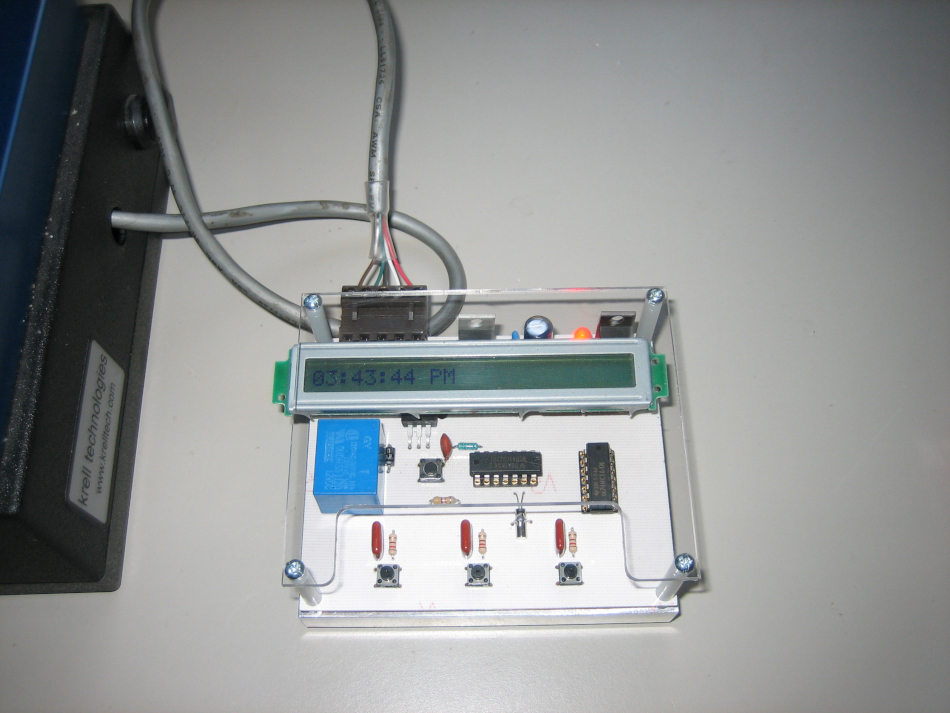

Msp430 based timer control.
I made this to control a friend's small optic fiber surface grinder, which didn't have timer functionality.
The timer uses the msp430's real time clock to close a relay for a pre-set amount of time.

